# Práctica 1

Integrantes: Rubén Calvo Villazán y Marta Arenas Martínez

## Instalación en VirtualBox

Para crear la máquina, primero se le dice que sistema operativo tiene (Linux). En mi caso, he dejado los tamaños de memoria y disco que venían por defecto. 

Para instalar Ubuntu Server, una vez creada la máquina, hay que meterse en la configuración, y en  el almacenamiento, seleccionar lo siguiente: 

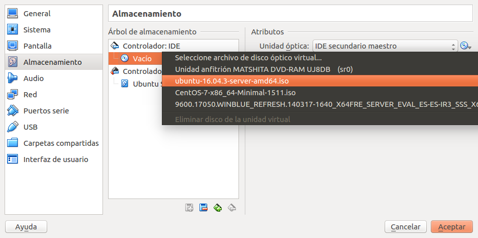

Para cambiar las redes, nos vamos a la opción Red de la configuración, y añadimos una **red interna**, para que las máquinas puedan comunicarse entre sí, de la siguiente manera:

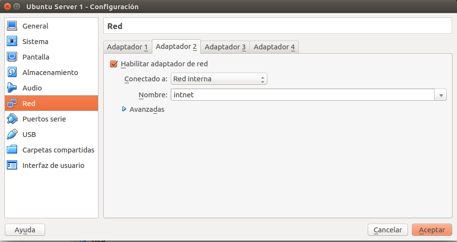

En mi caso, además de añadir la red interna, he añadido un tercer adaptador solo-anfitrión para que las máquinas puedan comunicarse con la máquina anfitriona.

Una vez añadidas las redes, podemos iniciar la máquina.

Como se dice en el pdf de la práctica, hay que instalar la máquina con LAMP (apache, mysql y php). Muestro unas capturas para que se vea que están funcionando:

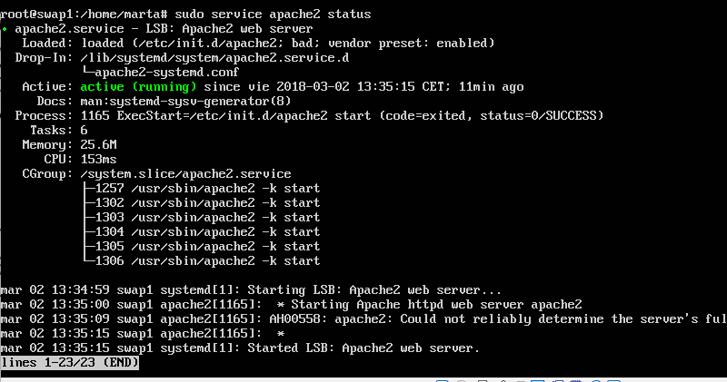

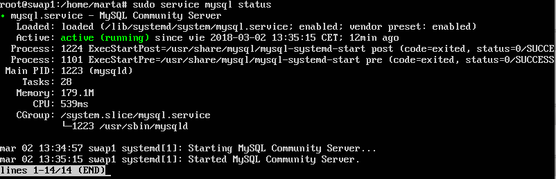

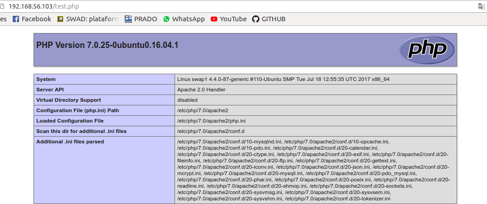

Para que las máquinas puedieran verse entre sí, he tenido que poner una ip fija en cada máquina, editanto el archivo **/etc/network/interfaces**

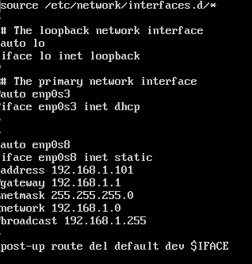

La última línea del archivo es porque tuve problemas al conectar la máquina a internet, y era porque por defecto se conectaba a la red interna. Lo que hace la última línea es que la que se conecte por defecto sea la NAT, y así poder tener acceso a internet.

A ambas máquinas hay que ponerles IPs distintas.

A continuación se muestra una captura con las máquinas comunicándose entre sí:

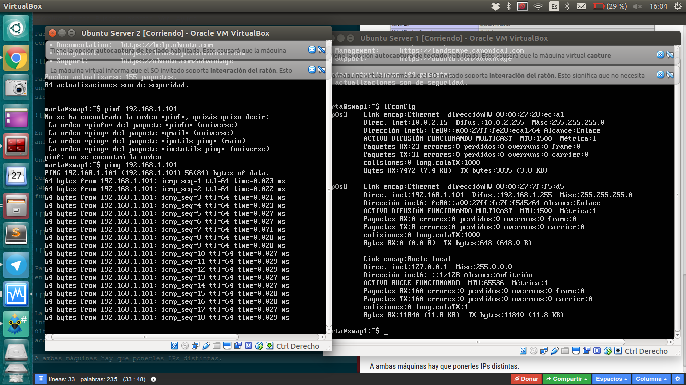

## Instalación en VMWare

 **Creamos las dos máquinas virtuales usando VMWare**

1. Tras instalar VMWare, le damos a crear nueva máquina y seleccionamos la ISO del sistema operativo Ubuntu Server.

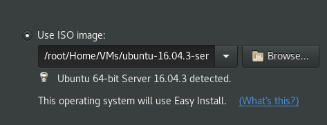

2. Posteriormente creamos el usuario del sistema junto con la contraseña:

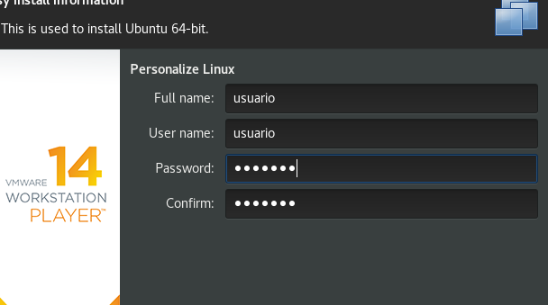

3. Asignamos el nombre a la máquina virtual. En nuestro caso se va a llamar **UbuntuS64-bit** y **2-UbuntuS64-bit**

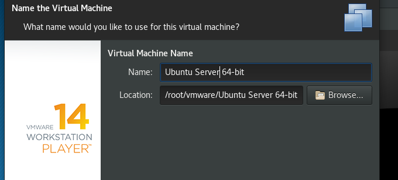

4. Establecemos el espacio en disco destinado para la máquina.

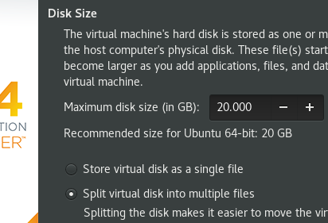

5. Confirmamos la configuración final de la máquina. Observamos que el adaptador de red se encuentra en modo NAT, de forma que recibe conexión a través del Host.

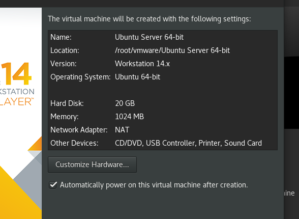

6. Se procedería de igual manera para crear la segunda máquina virtual con Ubuntu Server:

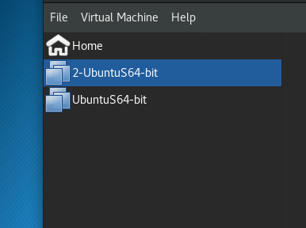


**Pruebas de conexión**

Realizamos la instalación del software necesario en cada máquina virtual.
Para ello ejecutamos en la terminal:

```shell
apt-get install apache2 mysql-server mysql-client openssh-server curl

```


Comprobamos la dirección IP de cada máquina. Para ello ejecutamos 

```shell
ifconfig

```

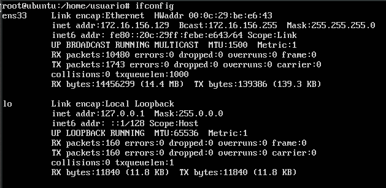

Obtenemos la dirección **172.16.156.129**

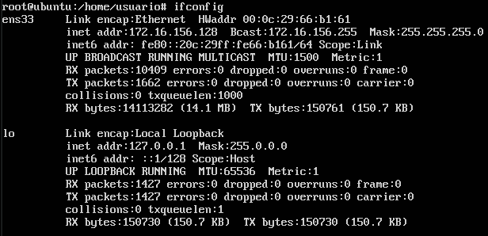

Obtenemos la dirección **172.16.156.128**

Si hacemos SSH de una máquina a otra:

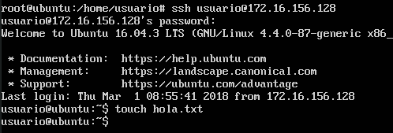

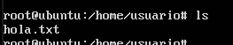


Y si activamos el servidor **apache** y hacemos **curl** de una máquina a otra:

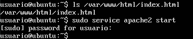

Obtenemos el fichero html de bienvenida de apache.

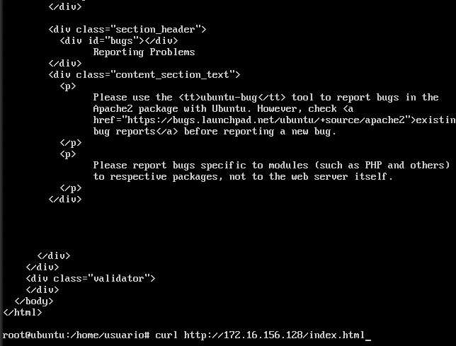
