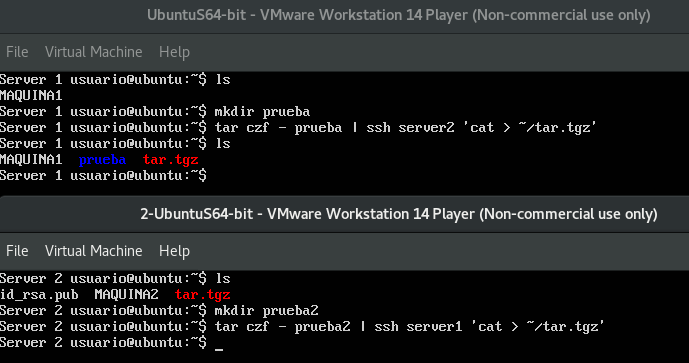
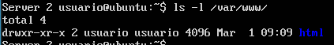
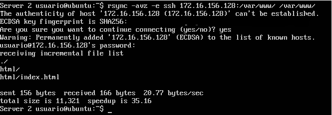
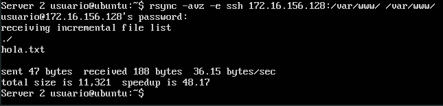
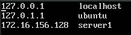
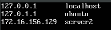

# Práctica 2

## Crear un tar con ficheros locales en un equipo remoto



## Sincronizar directorios con rsync

1. Ejecutamos el comando:

```shell
sudo chown -R usuario:usuario /var/www/

```
Para cambiar el propietario del directorio /var/www/ de **root** a **usuario**.



2. Tras realizar la instalación de rsync en ambas máquinas, ejecutamos el comando:

```shell
rsync -avz -e ssh 172.16.156.128:/var/www/ /var/www/

```

En el server 2 para vincularlo con el server 1.



3. Si en el server 1 creamos un fichero en /var/www/


Al ejecutar el comando anterior en el server 2, vemos que aparece el fichero creado en el directorio:




## SSH sin contraseña

1. Ejecutamos el comando 

```shell
ssh-keygen -b 4096 -t rsa
```
y seguimos las indicaciones para crear un par de claves **pública** y **privada**.

2. Exportamos la clave pública de una máquina a la otra para añadirla a los dispositivos de confianza.

```shell
ssh-copy-id usuario@172.16.156.128
```

Si no queremos especificar la IP de la máquina cada vez que nos queramos conectar por ssh, podemos establecerle un **alias** editando el fichero **/etc/hosts**





De forma que para conectarse, bastaría con hacer:

```shell
ssh server1
```

```shell
ssh server2
```

## Programar la tarea rsync

Si queremos que la tarea rsync se ejecute una vez cada hora, deberemos indicarle un minuto cualquiera (por ejemplo el minuto 0), de todas las horas, todos los días, cualquier día de la semana, etc.


