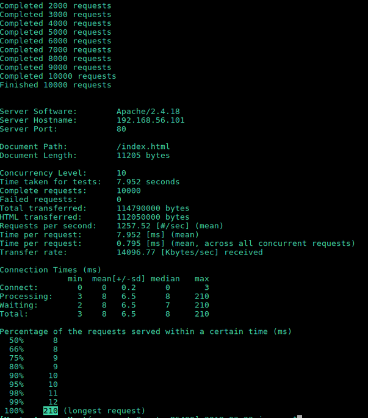

# Práctica 3

*Rubén Calvo Villazán
Marta Arenas Martínez*


## Configurar una máquina e instalar *nginx* como balanceador de carga

Para instalar *nginx* como balanceador de carga, hemos creado una máquina nueva con *Ubuntu Server*, y la hemos instalado como las otras máquinas pero sin Apache, para que no tuviera ocupado el puerto 80.

Una vez creada la máquina, hemos instalado *nginx* con la siguiente orden:
```shell
sudo apt-get install nginx
```
Hemos creado el archivo */etc/nginx/conf.d/default.conf*, ya que en nuestro caso no se ha creado al hacer la instalación:


Se inicia el servicio con

```shell
sudo service nginx start
```

Una vez iniciado el servicio, y dado que no nos ha salido ningún mensaje de error, podemos proceder a hacer peticiones a las máquinas de la granja. Las peticiones se hacen a la IP del propio balanceador, y es este el que reparte las peticiones entre máquinas:


## Configurar una máquina e instalar *haproxy* como balanceador de carga

Para instalar *haproxy*, hemos hecho una máquina nueva como en el caso de *nginx*.


Para iniciar el servicio de *haproxy*, se utiliza el siguiente comando:

```shell
sudo /usr/sbin/haproxy -f /etc/haproxy/haproxy.cfg
```

También hemos utilizado en este caso la herramienta *cURL* para hacer peticiones a las máquinas de la granja, utilizando la IP del mismo balanceador.


## Someter a la granja web a una alta carga con el benchmark de *Apache*

Para someter a la granja web a una alta carga, hemos utilizado el *benchmark* **Apache Benchmark** en ambos balanceadores.

```shell
ab -n 1000 -c 10 http://IP_BALANCEADOR/index.html
```
### Balanceador con *nginx*


### Balanceador con *haproxy*



Como puede verse, en nuestro caso *nginx* (8,816s) tarda más que *haproxy* (7.952s).