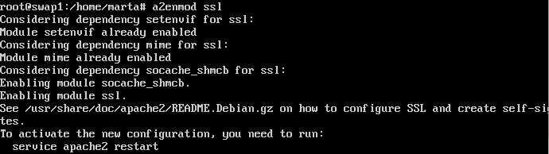
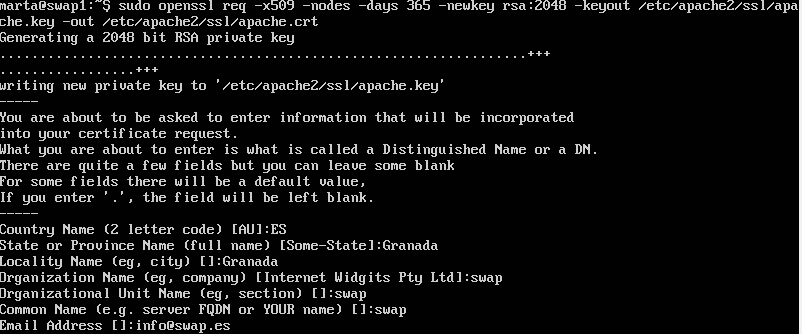
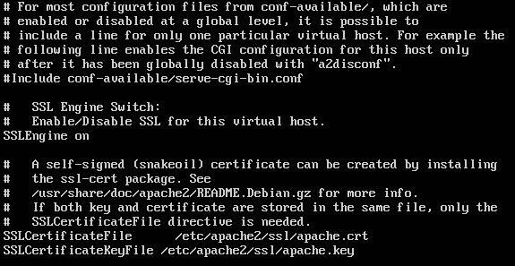
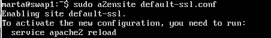
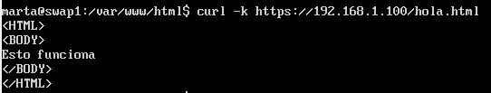
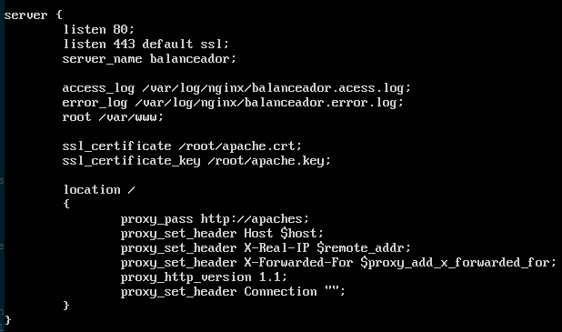
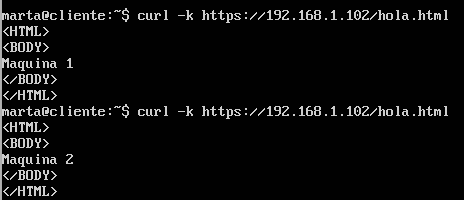
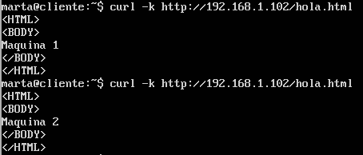
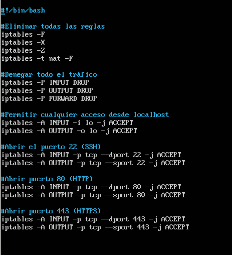

# Práctica 4

*Marta Arenas Martínez*
*Rubén Calvo Villazán*

## Instalar certificado SSL

### Instalación en máquinas servidoras
Para generar el certificado SSL autofirmado, debemos activar el módulo SSL de Apache, generar los certificados y especificarle la ruta a los certificados en la configuración:

```shell
sudo a2enmod ssl
```


Reiniciamos apache:

```shell
sudo service apache2 restart
```

Creamos una nueva carpeta:

```shell
sudo mkdir /etc/apache2/ssl
```

Generamos los certificados:

```shell
openssl req -x509 -nodes i-days 365 -newkey rsa:2048 -keyout
/etc/apache2/ssl/apache.key -out /etc/apache2/ssl/apache.crt
```
Con esto se han creado dos archivos, *apache.key* y *apache.crt* que se han guardado en la carpeta */etc/apache2/ssl*



Abrimos el archivo de configuración de ssl (*/etc/apache2/sites-available/default-ssl.conf*), y cambiamos las siguientes lineas:



*Se cambian las dos últimas líneas de la imagen.

Ahora activamos el sitio *default-ssl*:



Por último, reiniciamos apache:

```shell
sudo service apache2 reload
```

Ya podemos utilizar el servidor web HTTPS desde la misma máquina.



Para la segunda máquina, hicimos lo mismo que con la primera.

### Instalación en balanceador nginx

Para configurar el SSL en el balanceador nginx, lo primero es copiar los archivos *apache.key* y *apache.crt* desde alguna de las máquinas servidoras hasta el balanceador. En nuestro caso, hemos copiado los archivos en la carpeta */root*.

Una vez copiados los archivos, editamos el archivo */etc/nginx/conf.d/default.conf* y ponemos lo siguiente:



Reiniciamos la máquina, y comprobamos desde una máquina externa (cliente) que el https y http funcionan y que balancea bien:




## Configuración del cortafuegos

Para configurar el cortafuegos, hay que hacer un script con las ordenes de la aplicación iptables, y convertirlo en un demonio que se ejecute cada vez que se inicie el sistema de la máquina 1.



Para hacerlo demonio, hay que ejecutar las siguientes ordenes en la terminal de la máquina 1:

```shell
sudo cp cortafuegos.sh /etc/init.d/
sudo update-rc.d cortafuegos.sh defaults
```

Ahora, cada vez que se inicie el sistema, se ejecutará el script del cortafuegos.


