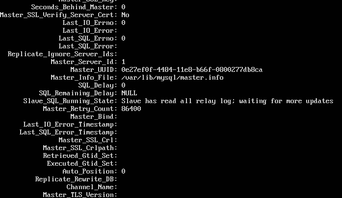

# Práctica 5

*Marta Arenas Martínez
Rubén Calvo Villazán*

## Crear base de datos

Para crear la base de datos, primero tenemos que meternos en *MySQL* con nuestra contraseña:

```shell
	mysql -u root -p
```

Una vez dentro, hacemos lo siguiente:

* Crear la base de datos: *create database contactos;*
* Utilizar la base de datos a la que queremos añadir cosas: *use contactos;*
* Crear la tabla: *create table datos(nombre varchar(100),tlf int);*
     
* Insertar datos: *insert into datos values("marta", 958000000);* y *insert into datos values("ruben", 958111111);*
     

## Realizar copia de seguridad con mysqldump

La copia de la base de datos **contactos** la vamos a realizar desde la máquina principal hasta la máquina secundaria.

Lo primero que hay que hacer es bloquear la base de datos en la máquina principal para que no se pueda actualizar mientras estamos haciendo la copia de seguridad. Eso se hace dentro de MySQL, con la orden *FLUSH TABLES WITH READ LOCK;*. Una vez hecho esto, salimos de MySQL y ejecutamos la siguiente orden:

```shell
mysqldump contactos -u root -p > /tmp/contactos.sql
```

Como antes habiamos bloqueado la base de datos, ahora hay que quitarle el bloqueo. Nos metemos en MySQL de nuevo en la máquina principal, y ejecutamos lo siguiente: *UNLOCK TABLES;*

Cambiamos a la máquina secundaria para copiar el archivo con todos los datos salvados:

```shell
	scp 192.168.1.100:/tmp/contactos.sql /tmp/
```

Dentro de MySQL en la máquina secundaria, creamos la base de datos donde queramos copiar la de la máquina principal: *create database contactos*.

Ya solo queda copiar los datos del archivo a la base de datos:

```shell
	mysql -u root -p contactos < /tmp/contactos.sql
```

Ya tenemos la base de datos copiada en la máquina secundaria.


## Replicación mediante configuración maestro-esclavo

Vamos a configurar el maestro en la máquina principal, y el esclavo en la máquina secundaria.

En la máquina principal, editamos el archivo */etc/mysql/mysql.conf.d/mysqld.cnf*:

* Comentamos la linea *bind-address 127.0.0.1*
* En el pdf de la práctica viene que hay que comentar la línea *log_error = /var/log/mysql/error.log*, pero en nuestro caso ya venía comentada.
* Cambiamos el identificador del servidor: *server-id=1*

Terminamos de editar el archivo, y reini

```shell
	sudo service mysql restart
```

Una vez terminada la configuración del maestro, nos vamos a la máquina secundaria (esclavo).

Para el esclavo, hay que editar el archivo anterior igual, pero poniendo el *server-id* a 2. De nuevo, reiniciamos el servicio.

Ahora, volvemos a la máquina principal y nos metemos en MySQL. Tenemos que crear un usuario y darle permisos de acceso para la replicación:

* CREATE USER esclavo IDENTIFIED BY 'esclavo';
* GRANT REPLICATION SLAVE ON \*.\* TO 'esclavo'@'%' IDENTIFIED BY 'esclavo';
* FLUSH PRIVILEGES;
* FLUSH TABLES;
* FLUSH TABLES WITH READ LOCK;

En el maestro, obtenemos los datos de la BD que vamos a replicar:


Vamos a la máquina secundaria, y en MySQL le damos los datos del maestro:


Por último, arrancamos el esclavo con *START SLAVE*, y desbloqueamos las tablas del maestro para poder añadir nuevos datos con *UNLOCK TABLES*.

Para asegurarnos de que funciona, nos vamos al cliente y ejecutamos la orden siguiente: *SHOW SLAVE STATUS\G;*



En nuestro caso, tuvimos un problema. Salió el error de que ambas máquinas, maestro y esclavo, tenían el mismo UUID. Para solucionar el error, sólo tuvimos que borrar el archivo */var/lib/mysql/auto.cnf* y reiniciar MySQL.

Asi, cuando iniciamos MySQL, la máquina esclava crea un nuevo UUID distinto al del maestro.

Podemos ver que el valor de la variable *Seconds_Behind_Master* es 0, lo que nos demuestra que la configuración está bien hecha.

Para comproblar que funciona, tenemos que ver que, si hacemos un cambio en la base de datos del maestro, se verá reflejado en el esclavo.


